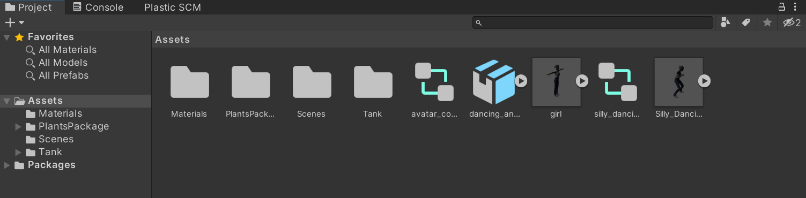
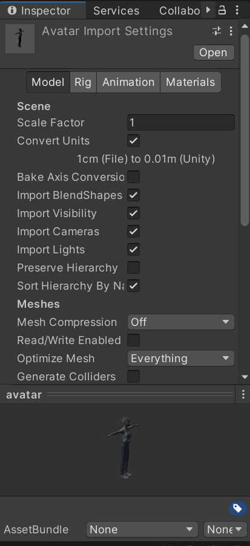
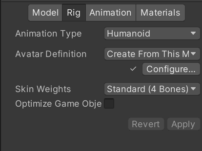
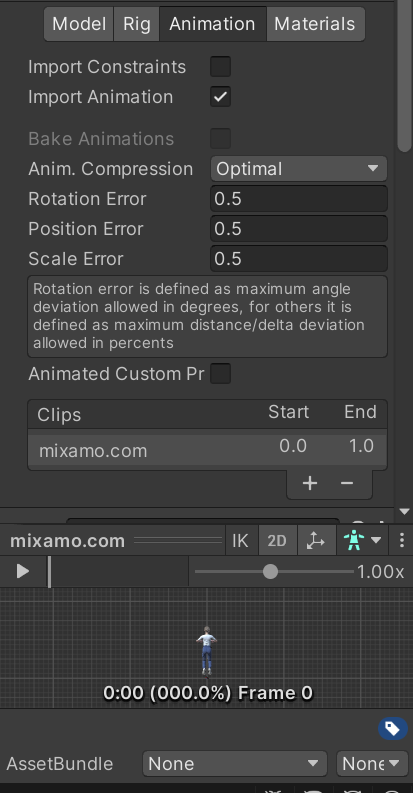
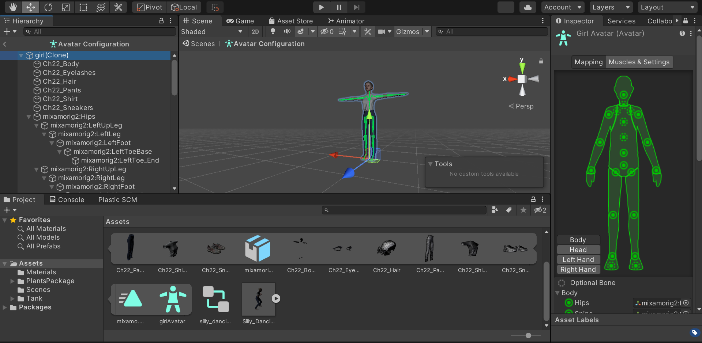
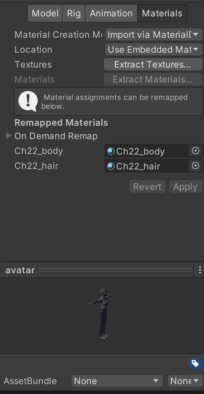

# Unity tutorial - external models
## 1. Introduction to models
In Unity, models are files describing 3D objects. This includes their shape and appearance. Models are used to create for example characters or terrain, and are also able to create animations.

They often include textures or materials. It's common to create the models in external programs like Blender and then import them in Unity.

Unity provides the possibility to create prefabs - a model with presaved settings that can be reused for creating multiple instances of the same object.
## 2. Creating modes
Add your content here.
## 3. Importing models
In the [Unity asset store](https://assetstore.unity.com/?category=3d&free=true&orderBy=1), you can find many (also free) resources, including models. However, also [mixamo](https://www.mixamo.com) provides great resources.

It's best to import the model as a fbx file (best support). Furthermore, humanoid models should be in a T-pose, then several skinless animations can be added almost effortless.
### 3.1 Importing a model
There are several steps to import a model:
1. Open import settings window
    - Move the model and its animations to the asset folder in the project window.

    - Open the import setting window (opens up in inspector tab) by clicking on the model.
    

2. Set importer options (model tab)
    - change scale
    - influence details to improve performance
    - activate colliders
    - decide what shall be imported (visibility, camera, lights)

| Property | Function |
| :--- | :--- |
| Scale Factor | Set this value to apply a global scale on the imported Model whenever the original file scale (from the Model file) does not fit the intended scale in your Project. Unity’s physics system expects 1 meter in the game world to be 1 unit in the imported file. |
| Convert Units | Enable this option to convert the Model scaling defined in the Model file to Unity’s scale. |
| Bake Axis conversion | Enable this property to bake the results of axis conversion directly into your application’s asset data (for example, vertex or animation data) when you import a Model that uses a different axis system than Unity. Disable this property to compensate the Transform component of the root GameObject at runtime to simulate axis conversion. |
| Import BlendShades | Enable this property to allow Unity to import blend shapes with your Mesh. Importing blend shape normals requires smoothing groups in the FBX file. |
| Import Visibility | Import the FBX settings that define whether or not MeshRenderer components are enabled (visible). |
| Import Cameras | Import cameras from your .FBX file. |
| Import Lights | Import lights from your .FBX file. |
| Preserve history | Always create an explicit prefab root, even if this model only has a single root. Normally, the FBX Importer strips any empty root nodes from the model as an optimization strategy. However, if you have multiple FBX files with portions of the same hierarchy you can use this option to preserve the original hierarchy. |
| Sort hierachy by name | Enable this property to sort GameObjects by alphabetical order within the hierarchy. Disable this property to preserve the hierarchy order defined in the FBX file. |
| Mesh compression | Set the level of compression ratio to reduce the file size of the Mesh. Increasing the compression ratio lowers the precision of the Mesh by using the mesh bounds and a lower bit depth per component to compress the mesh data.It’s best to turn it up as high as possible without the Mesh looking too different from the uncompressed version. This is useful for optimizing game size. |
| Read/Write Enabled | When you enable this option, Unity uploads the Mesh data to GPU-addressable memory, but also keeps it in CPU-addressable memory. This means that Unity can access the Mesh data at run time, and you can access it from your scripts. For example, you might want to do this if you’re generating a Mesh procedurally, or if you want to copy some data from a Mesh.When this option is disabled, Unity uploads the Mesh data to GPU-addressable memory, and then removes it from CPU-addressable memory.By default, this option is disabled. In most cases, to save runtime memory usage, leave this option disabled. |
| Optimize Mesh | Determine the order in which triangles are listed in the Mesh for better GPU performance. |
| Generate Colliders | Enable to import your Meshes with Mesh Colliders automatically attached. This is useful for quickly generating a collision Mesh for environment geometry, but should be avoided for geometry you are moving. |
| Keep Quads | Enable this to stop Unity from converting polygons that have four vertices to triangles. For example, if you are using Tessellation Shaders, you may want to enable this option because tessellating quads may be more efficient than tessellating polygons.Unity can import any type of polygon (triangle to N-gon). Polygons that have more than four vertices are always converted to triangles regardless of this setting. However, if a mesh has quads and triangles (or N-gons that get converted to triangles), Unity creates two submeshes to separate quads and triangles. Each submesh contains either triangles only or quads only. Tip: If you want to import quads into Unity from 3ds Max, you have to export it as an Editable Poly. |
| Weld verticles | 	Combine vertices that share the same position in space, provided that they share the same properties overall (including, UVs, Normals, Tangents, and VertexColor). This optimizes the vertex count on Meshes by reducing their overall number. This option is enabled by default. In some cases, you might need to switch this optimization off when importing your Meshes. For example, if you intentionally have duplicate vertices which occupy the same position in your Mesh, you may prefer to use scripting to read or manipulate the individual vertex and triangle data. |
| Index format | Define the size of the Mesh index buffer. Note: For bandwidth and memory storage size reasons, you generally want to keep 16 bit indices as default, and only use 32 bit when necessary, which is what the Auto option uses. |
| Legacy blend shape normals | Enable this option to compute normals based on the Smoothing Angle value. |
| Normals | Defines if and how normals should be calculated. This is useful for optimizing game size. |
| Blend shape normals | Defines if and how Unity should calculate normals for blend shapes. This value should match the value for the Normals property. This property is only visible when Legacy Blend Shape Normals is disabled. |
| Normals mode | Define how the normals are calculated by Unity. This is only available when Normals is set to Calculate or Import. |
| Smoothness source | Set how to determine the smoothing behavior (which edges should be smooth and which should be hard). This property is only visible when Legacy Blend Shape Normals is disabled. |
| Smoothing angle | Control whether vertices are split for hard edges: typically higher values result in fewer vertices. Note: Use this setting only on very smooth organics or very high poly models. Otherwise, you are better off manually smoothing inside your 3D modeling software and then importing with the Normals option set to Import (above). Since Unity bases hard edges on a single angle and nothing else, you might end up with smoothing on some parts of the Model by mistake. Only available if Normals is set to Calculate. |
| Tangents | Define how vertex tangents should be imported or calculated. This is only available when Normals is set to Calculate or Import. |
| Swap UVs | Swap UV channels in your Meshes. Use this option if your diffuse Texture uses UVs from the lightmap. Unity supports up to eight UV channels but not all 3D modeling applications export more than two. |
| Generate Lightmap UV | Creates a second UV channel for Lightmapping. |

(table from [unity documentation](https://docs.unity3d.com/2023.3/Documentation/Manual/FBXImporter-Model.html) )

3. Rigs and animation settings
    - differentiate between animation types humanoid and non-humanoid settings -> humanoid needs bone structure / avatar
    - some properties are specific to the animation type

| Property | Function |
| :--- | :--- |
| Animation type | Specfiy the type of animation. |
| Avatar definition | Choose where to get the Avatar definition. |
| Root node | Select the bone to use as a root node for this Avatar. This setting is only available if you set the Avatar Definition to Create From This Model. |
| Source | Copy another Avatar with an identical rig to import its animation clips. This setting is only available if you set the Avatar Definition to Copy from Other Avatar. |
| Skin weights | Set the maximum number of bones that can influence a single vertex. |
| Max Bones / Vertex | Set the maximum number of bones per vertex to influence a given vertex. You can set between 1 and 32 bones per vertex, but the higher the number of bones you use to influence a vertex, the greater the performance cost. This setting is only available you set the Skin Weights property to Custom. |
| Max Bone Weight | Set the bottom threshold for considering bone weights. The weighting calculation ignores anything smaller than this value, and Unity scales up the bone weights higher than this value to a total of 1.0. This setting is only available if the Skin Weights property is set to Custom. |
| Optimize game object | Remove and store the GameObject Transform hierarchy of the imported character in the Avatar and Animator component. If enabled, the SkinnedMeshRenderers of the character use the Unity animation system’s internal skeleton, which improves the performance of the animated characters. Only available if the Avatar Definition is set to Create From This Model |
| Extra transforms to expose | Specify which Transform paths you want Unity to ignore when Optimize Game Object is enabled. This section only appears when Optimize Game Object is enabled. |
| Configure... | Open the Avatar configuration.Only available if the Avatar Definition is set to Create From This Model. |

(table from [unity documentation](https://docs.unity3d.com/2023.3/Documentation/Manual/FBXImporter-Rig.html) )

| Property | Function |
| :--- | :--- |
| Import Constraints | Import constraints from this asset. |
| Import Animation | Import animation from this asset. |
| Bake Animations | Bake animations created using IK or Simulation to forward kinematic keyframes.Only available for Autodesk® Maya®, Autodesk® 3ds Max® and Cinema 4D files. |
| Resample curves | Resample animation curves as Quaternion values and generate a new Quaternion keyframe for every frame in the animation. This option only appears if the import file contains Euler curves. This option is enabled by default. Disable this option to keep animation curves as they were originally authored. You should only disable this option if there are interpolation issues in the resampled animation when compared with your original animation. |
| Anim. Compression | The type of compression to use when importing the animation. |
| Animation Compression Errors | Only available when Keyframe Reduction or Optimal compression is enabled. |
| Animated Custom values | Import any FBX properties that you designated as custom user properties. Unity only supports a small subset of properties when importing FBX files (such as translation, rotation, scale and visibility). However, you can treat standard FBX properties like user properties by naming them in your importer script via the extraUserProperties member. During import, Unity then passes any named properties to the Asset postprocessor just like ‘real’ user properties. |
| Clip selection list | Add, modify, play, remove clips. |
| Loop time | Play the animation clip through and restart when the end is reached. |
| Root Transform Rotation - Bake into Position | Bake root rotation into the movement of the bones. Disable to store as root motion. |
| Root Transform Rotation - Base Upon | Basis of root rotation. |
| Offset | Offset to the root rotation (in degrees). |
| Mirror | Mirror left and right in this clip.Only appears if the Animation Type is set to Humanoid. |
| Additive Reference Pose | Enable to set frame for the reference pose used as the base for the additive animation layer. A blue marker becomes visible in the timeline editor. |
| Curves | Expand this section to manage animation curves for this animation clip. | 
| Events | Expand this section to manage animation events for this animation clip. |
| Mask | Expand this section to manage Avatar masking for this animation clip. |
| Motion | Expand this section to manage the root motion node for all imported clips. |
| Import messages | Expand this section to see detailed information about how your animation was imported, including an optional Retargeting Quality Report. |
| Animation preview | See animation of model. |

(table from [unity documentation](https://docs.unity3d.com/2023.3/Documentation/Manual/FBXImporter-Rig.html) )

    - avatar masking can be used to adjust the skeleton and muscles and also influence animations

4. Apply materials and textures (mostly just click extract textures / materials respectively)
    

    - with fbx files, just extract both in the materials tab of the model

| Property | Function |
| :--- | :--- |
| Material Creation Mode | Define how you want Unity to generate or import the Materials for your Model. When you choose None from this drop-down menu, the Inspector hides the rest of the settings on this tab. |
| sRGB Albedo Colors | Enable this option to use Albedo colors in gamma space. This is enabled by default for legacy import methods. Disable this for Projects using linear color space. This property is not available if you choose Import via MaterialDescription (Experimental) from the Material Creation Mode drop-down menu. |
| Location | Define how to access the Materials and Textures. Different properties are available depending on which of these options you choose. |
| Remapping materials | New imports or changes to the original Asset do not affect extracted Materials. If you want to re-import the Materials from the source Asset, you need to remove the references to the extracted Materials in the Remapped Materials list. To remove an item from the list, select it and press the Backspace key on your keyboard. |

(table from [unity documentation](https://docs.unity3d.com/2023.3/Documentation/Manual/FBXImporter-Materials.html) )

### 3.2 Special settings for humanoid models
5. In the Rig tab of the animation, change the animation type to humanoid
6. As avatar definition, choose "Copy from other avatar" and point to your model avatar
7. In the assets folder, create an Animator controller
8. Click on the Animator controller and drag and drop the animation
9. Drag and drop this animator controller in your models animator tab in the controller field
10. Now its ready to play the scene and see your character executing the animation.

---

### Resources
- https://docs.unity3d.com/2023.3/Documentation/Manual/models.html
- https://www.youtube.com/watch?v=0QA2O7juuWQ